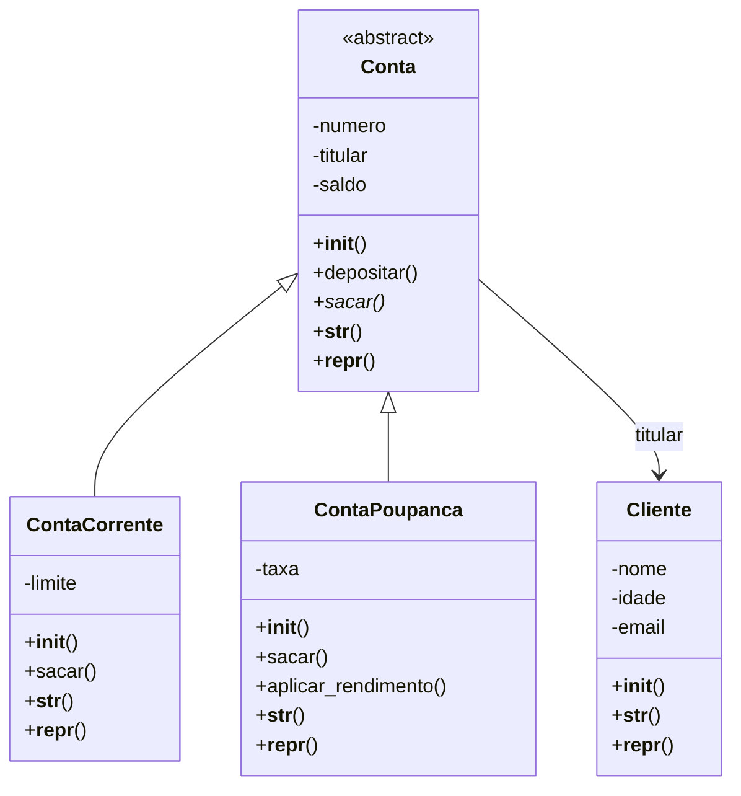

# Sistema Bancário Orientado a Objetos

## 1. Descrição do projeto

Este projeto apresenta um sistema bancário desenvolvido em Python, utilizando os principais conceitos de Programação Orientada a Objetos (POO).

O sistema permite cadastrar clientes, criar contas correntes e poupanças, realizar depósitos e saques, aplicar rendimentos e validar informações.

O objetivo é demonstrar, na prática, o funcionamento de classes, objetos, encapsulamento, herança, polimorfismo e classes abstratas.

## 2. Tecnologias utilizadas

- Python 3
- Portugol Studio
- Git e GitHub

O código Python utiliza as bibliotecas `abc` e `re`, que fazem parte da biblioteca padrão da linguagem.

## 3. Estrutura de classes

O projeto possui quatro classes principais:

**Cliente:** armazena nome, idade e e-mail do cliente.

**Conta:** classe abstrata que define os atributos e métodos comuns às contas bancárias.

**ContaCorrente:** herda de `Conta` e permite saques utilizando o saldo e o limite disponível.

**ContaPoupanca:** herda de `Conta` e permite saques dentro do saldo, além da aplicação de rendimentos.

### Diagrama de classes — Mermaid



## 4. Decisões de modelagem

### Herança

A herança foi utilizada porque `ContaCorrente` e `ContaPoupanca` são tipos de `Conta`.

As duas classes compartilham atributos, como número, titular e saldo, além do método `depositar()`.

O método `super().__init__()` permite reutilizar o construtor da classe mãe, evitando repetição de código.

### Composição

A composição aparece no relacionamento entre `Conta` e `Cliente`.

Uma conta possui um cliente como titular. Por isso, a classe `Conta` recebe um objeto `Cliente`, em vez de herdar suas características.

### Classe abstrata

A classe `Conta` utiliza `ABC` e `@abstractmethod` para definir o método `sacar()` como obrigatório nas subclasses.

Assim, não é possível criar diretamente um objeto da classe `Conta`.

### Polimorfismo

O método `sacar()` possui implementações diferentes:

- Na conta corrente, o saque pode utilizar o saldo e o limite disponível.
- Na poupança, o saque não pode ultrapassar o saldo.

Isso permite percorrer uma lista de contas diferentes e chamar o mesmo método em todas elas.

## 5. Encapsulamento e validações

O projeto utiliza `@property` para controlar o acesso e a alteração dos atributos.

| Atributo        | Validação                         |
| --------------- | --------------------------------- |
| Nome            | Texto com pelo menos 3 caracteres |
| Idade           | Número inteiro entre 0 e 120      |
| E-mail          | Formato básico válido             |
| Número da conta | Inteiro positivo                  |
| Titular         | Objeto da classe `Cliente`        |
| Saldo           | Valor numérico não negativo       |
| Limite          | Valor numérico não negativo       |
| Taxa            | Valor entre 0 e 1                 |

As validações são realizadas durante a criação dos objetos e também quando seus atributos são alterados.

Caso um valor inválido seja informado, o sistema gera uma exceção.

## 6. Métodos especiais

O sistema utiliza os seguintes métodos especiais:

- `__init__`: inicializa os objetos.
- `__str__`: apresenta as informações de forma amigável.
- `__repr__`: fornece uma representação técnica do objeto.

Esses métodos estão presentes nas quatro classes.

## 7. Exemplos de utilização

### Criando um cliente e uma conta

```python
cliente = Cliente("Ana Silva", 25, "ana@gmail.com")

conta = ContaCorrente(1001, cliente, 1000, 500)

print(conta)
```

### Realizando um depósito

```python
conta.depositar(200)

print(conta.saldo)
```

Resultado:

```text
1200
```

### Demonstrando o polimorfismo

```python
contas = [
    ContaCorrente(1001, cliente, 1000, 500),
    ContaPoupanca(2001, cliente, 1000, 0.01)
]

for conta in contas:
    try:
        conta.sacar(1200)
    except ValueError as erro:
        print(erro)
```

A conta corrente consegue realizar o saque utilizando parte do limite, enquanto a poupança apresenta um erro de saldo insuficiente.

### Testando uma validação

```python
try:
    cliente.idade = -5
except ValueError as erro:
    print(erro)
```

Resultado:

```text
Idade inválida.
```

## 8. Testes realizados

O programa cria 10 clientes e 10 contas bancárias, totalizando 20 objetos.

Durante a execução, são demonstrados:

- Cadastro de clientes e contas.
- Saques com comportamentos diferentes.
- Aplicação de rendimentos.
- Validação de dados.
- Tratamento de exceções com `try/except`.
- Tentativa de instanciar uma classe abstrata.

## 9. Como executar

É necessário ter o Python 3 instalado.

Abra o terminal na pasta do projeto e execute:

```bash
python sistema_completo.py
```

O programa apresentará as contas cadastradas, executará as operações e exibirá os saldos finais.

## 10. Versão em Portugol

O projeto também possui uma versão equivalente em Portugol Studio.

Como o Portugol não oferece os mesmos recursos de orientação a objetos do Python, as operações foram representadas por funções, vetores e estruturas condicionais.

Essa versão permite comparar a lógica da programação estruturada com a programação orientada a objetos.

## 11. Conclusão

O desenvolvimento deste sistema permitiu aplicar os conceitos fundamentais da Programação Orientada a Objetos em Python.

A utilização de classes e objetos facilitou a organização dos dados, enquanto o encapsulamento contribuiu para impedir valores inválidos.

A herança possibilitou reutilizar métodos, e o polimorfismo permitiu que diferentes tipos de contas respondessem à mesma operação de maneiras distintas.

Por fim, o uso de uma classe abstrata ajudou a estabelecer uma estrutura comum para as contas bancárias, tornando o projeto mais organizado e reutilizável.
